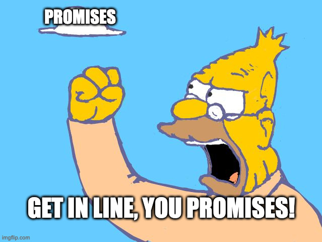

# PromiseLane

A super simple promise queue in pure JavaScript. The slogan:



**Inspiration:** ThePrimeagean mentioned a few times that one of his favorite questions to ask on interview to validate if a person understands how Promises work is implementing a promise queue. I doubt I will ever be interviewed by him but it sounded like a great mini challenge.

## Usage

```js
const p1 = () => new Promise((resolve, reject) => {
    setTimeout(resolve, 1000, 'hello')
});

const p2 = () => new Promise((resolve, reject) => {
    setTimeout(resolve, 100, 'world')
});

// only allow one Promise to run at a time
const promiseLane = new PromiseLane(1);

const w1 = promiseLane.add(p1);
const w2 = promiseLane.add(p2);

w1.then((v) => console.log(v));
w2.then((v) => console.log(v));

// Output:
// hello
// world
```

## Great learning resources that helped me to do this project

- [Blazingly fast JavaScript workshop by ThePrimeagean](https://frontendmasters.com/workshops/fast-javascript/) on FrontEnd Masters;

- [MDN docs about Promises](https://developer.mozilla.org/en-US/docs/Web/JavaScript/Reference/Global_Objects/Promise).
